# azfuncblob


# Azure Function for Blob Storage Triggers

## Overview

This guide walks you through creating an **Azure Function App** on macOS using **Visual Studio Code**. You will integrate it with an **Azure Storage Account** that contains a container named `images`. The function will be triggered every time a new image is uploaded, and it will log the file’s name and size. This demonstrates how to use serverless functions to respond to real-time events.

---

## Objective

By the end of this lab, you will be able to:

- Create an **Azure Function App** using VS Code.
- Set up an **Azure Blob Storage** container.
- Configure the function to **trigger on new uploads**.
- Extract and **log metadata** (image name and size).
- Test and **verify functionality** using Azure logs.

---

## Prerequisites

- [Azure account](https://portal.azure.com/#home) with an active subscription  
- [Visual Studio Code](https://code.visualstudio.com/) installed  
- Azure CLI installed (macOS):  
  Install via Homebrew:
  ```bash
  brew install azure-cli
  ```

- Azure Functions Core Tools installed:
  ```bash
  brew tap azure/functions
  brew install azure-functions-core-tools@4
  ```

- Azure Function, Azure Storage, and C# (or Python/JavaScript, as needed) extensions installed in VS Code  

---

## Step 1: Sign in to Azure

1. Open [Azure Portal](https://portal.azure.com/#home).
2. Enter your credentials:
   - **Username**: `yourusername`
   - **Password**: `acntapssword!`
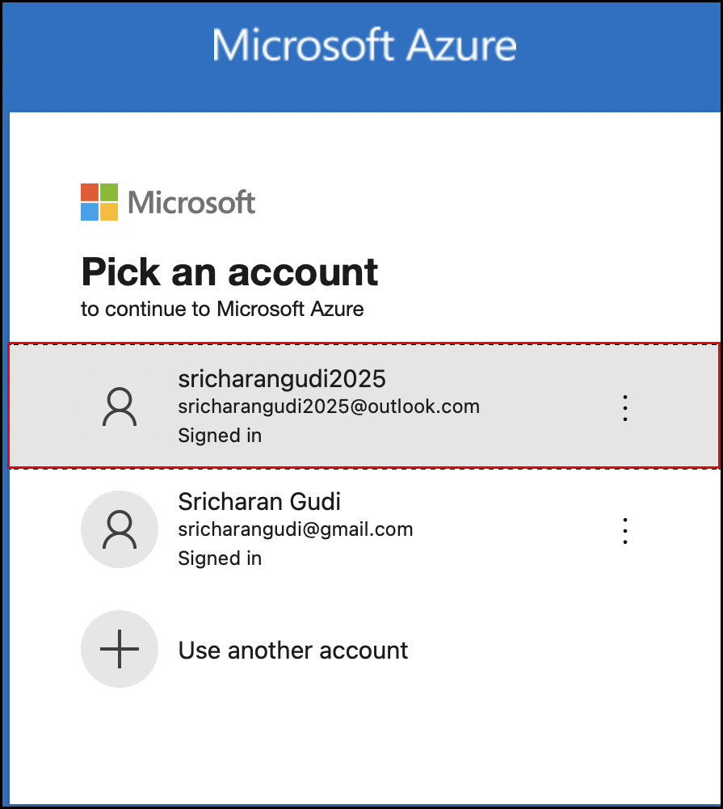

---

## Step 2: Launch Visual Studio Code on macOS

1. Press `Cmd + Space` and type `Visual Studio Code`.
2. Click on **Visual Studio Code** from the search results to open it.
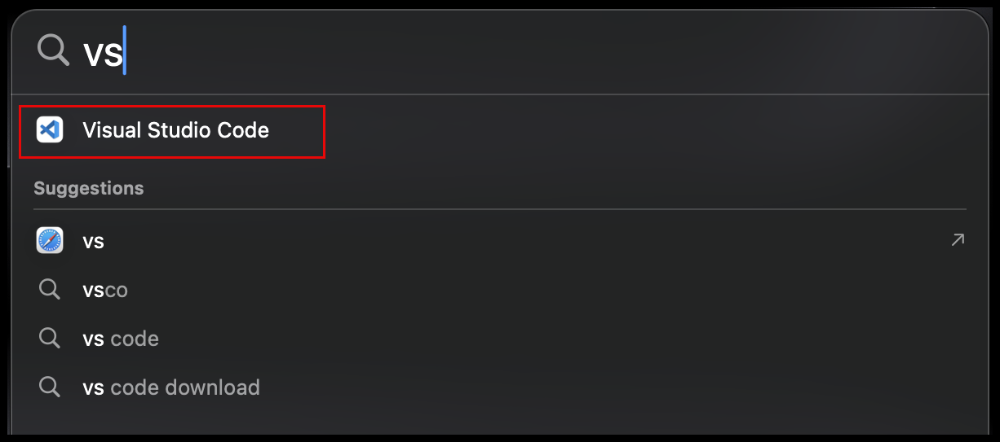

---

## Step 3: Install Required Extensions in VS Code

Open the **Extensions** panel (⇧ + ⌘ + X) and install the following:

- **Azure Functions**
- **Azure Storage**
- **C#**, **Python**, or **JavaScript** extension depending on your function language.
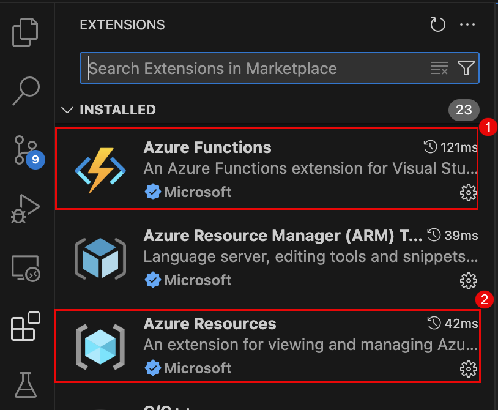

---

## Step 4: Sign in to Azure via VS Code

1. Press `Cmd + Shift + P` to open the Command Palette.
2. Search for `Azure: Sign In` and select it.
3. Complete sign-in via browser when prompted.
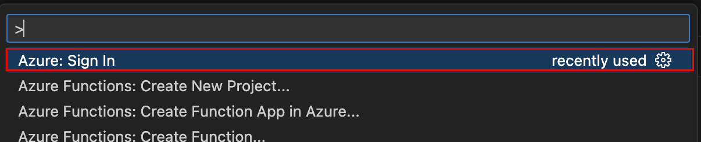

---

## Step 5: Create a Function App Project

1. In the Command Palette (`Cmd + Shift + P`), type `Azure Functions: Create New Project`.
2. Select a folder where the project will be stored.
3. Choose your preferred language (e.g., **JavaScript**, **Python**, or **C#**).
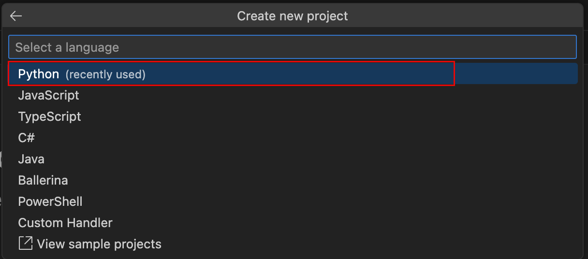
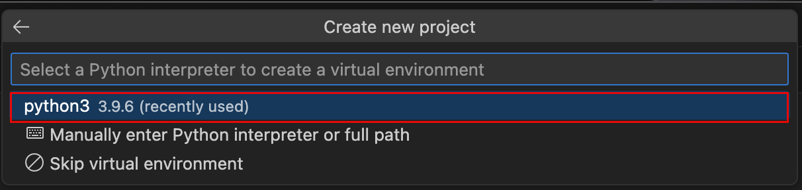
5. Choose a template: Select `Blob Storage trigger`.
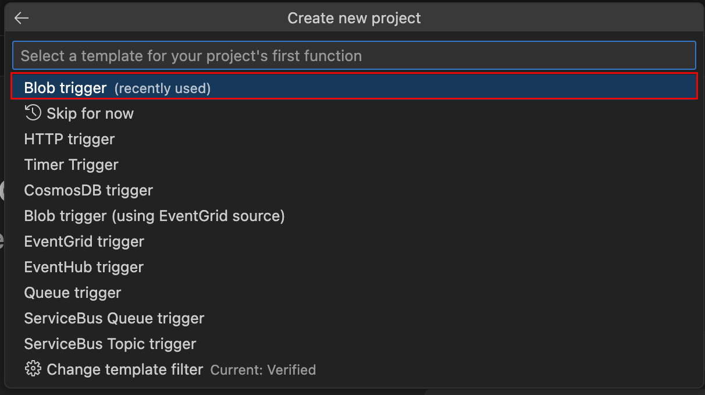
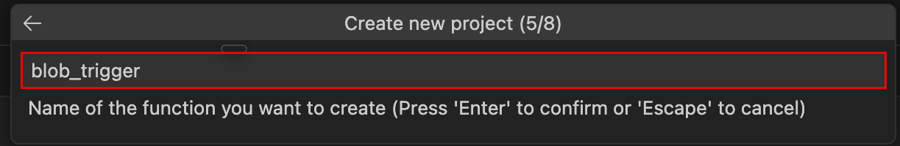
7. Provide the function name (e.g., `ImageUploadTrigger`).
8. Enter the **path to the blob container**:  
   ```plaintext
   images/{name}
   ```
9. Enter the name of the **Storage Account connection string setting** (e.g., `sricharan`).
10. When prompted to select a folder for your project, the **Select Folder** dialog will appear. From the left panel, Click on **New folder** button.


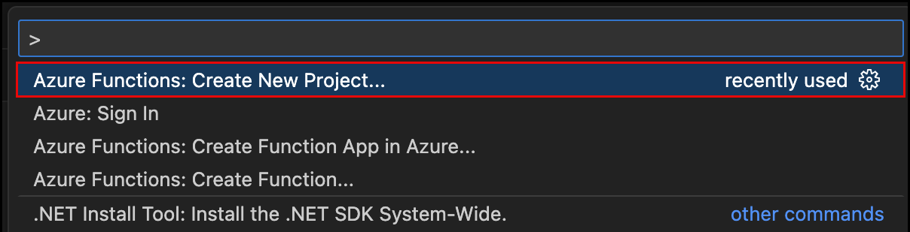
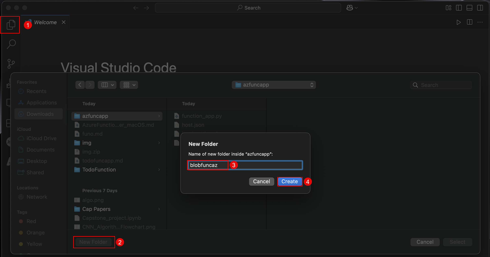


---

## Step 6: Create or Configure the Storage Account

1. In the **Azure Portal**, create a **Storage Account** if you don't already have one:
   - Go to **Storage Accounts** → **Create**
   - Choose **Region**, **Resource Group**, and give it a name.
2. After creation, navigate to **Containers** and create a new container called `images`.
3. Set its access level to **Private**.
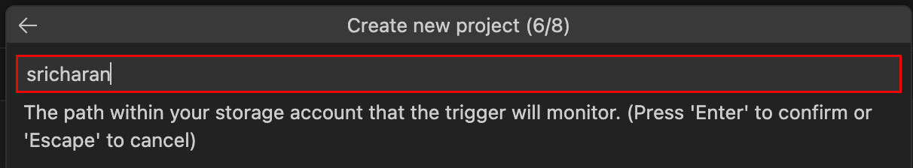


---

## Step 7: Set Up Local Configuration

1. In the `local.settings.json` file of your function app, add the connection string for the storage account:
   ```json
   {
     "IsEncrypted": false,
     "Values": {
       "AzureWebJobsStorage": "<your-connection-string>",
       "FUNCTIONS_WORKER_RUNTIME": "node"
     }
   }
   ```
   Replace `<your-connection-string>` with the actual connection string from Azure Portal.
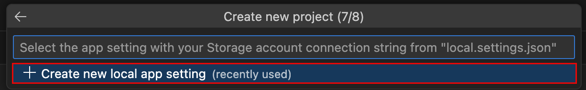
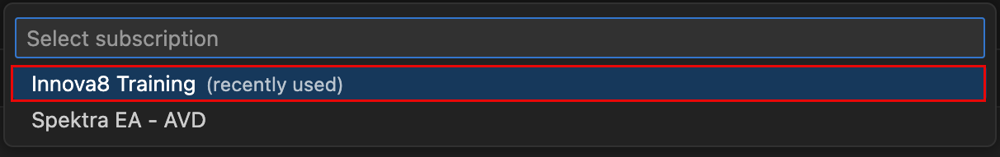
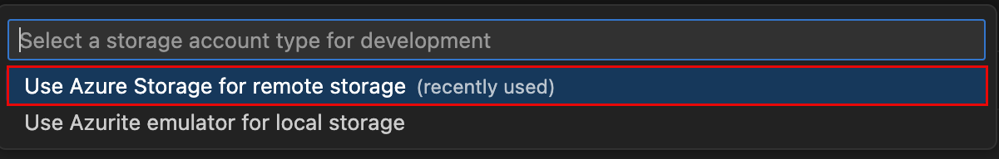
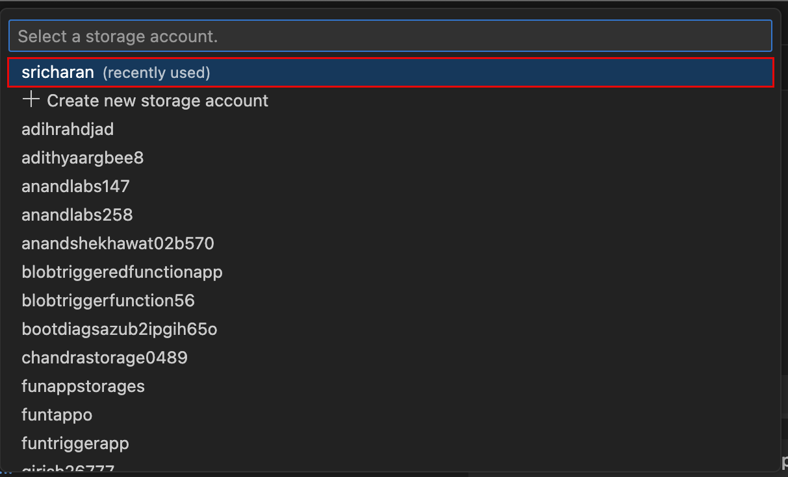
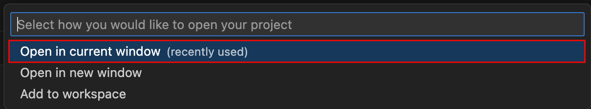
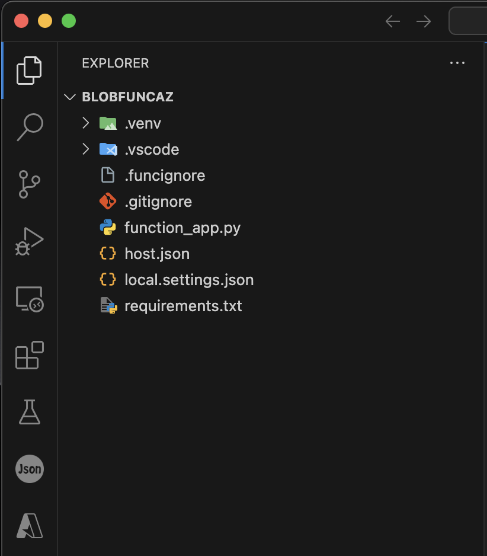
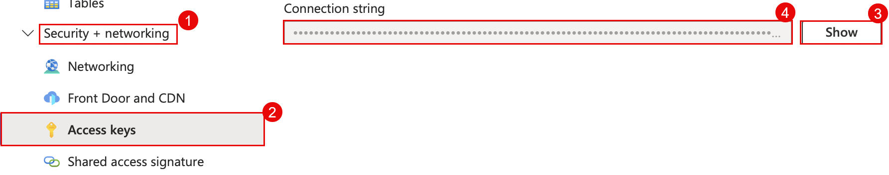


---

## Step 8: Implement the Blob Trigger Function

For **Python**:

```python
import logging

def main(myblob: bytes, name: str):
    logging.info(f"Blob trigger function processed blob \nName: {name} \nSize: {len(myblob)} Bytes")
```


---

## Step 9: Test Locally (Optional)

1. Open terminal in VS Code.
2. Run the function locally:
   ```bash
   func start
   ```
3. Upload a file to the `images` container using Azure Storage Explorer or Portal and observe logs.

---

## Step 10: Deploy to Azure

1. In the VS Code **Azure tab**, right-click your function project folder → **Deploy to Function App**.
2. Select **+ Create new Function App in Azure** if needed.
3. Choose a **runtime stack**, a **region**, and a **unique app name**.
4. Confirm the deployment.
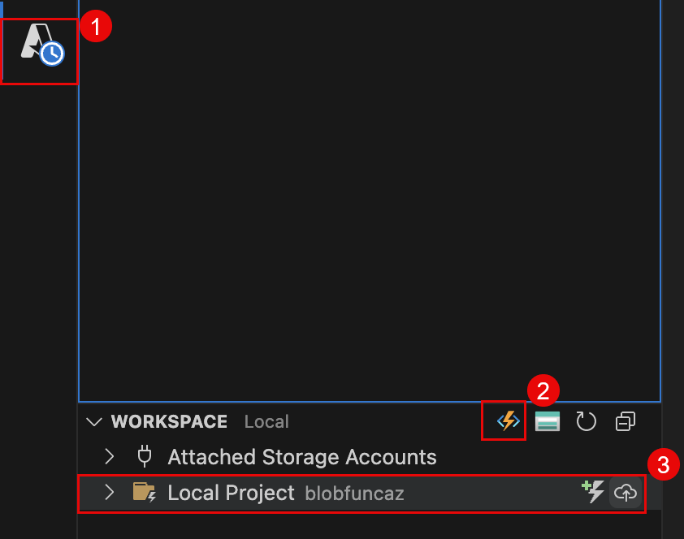

---

## Step 11: Upload a File and Verify Trigger

1. Upload an image to the `images` container in your Azure Storage Account.
2. Go to the **Azure Portal** → your **Function App** → **Logs** or **Monitor**.
3. You should see log output similar to:
   ```
   Blob trigger function processed blob
   Name: sample.jpg
   Size: 204800 Bytes
   ```
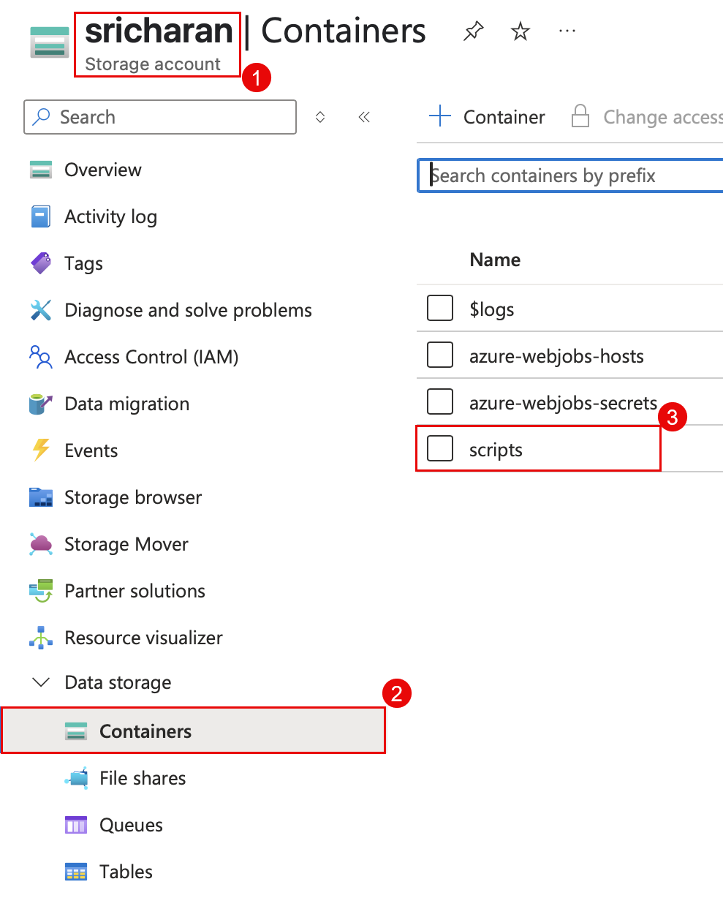
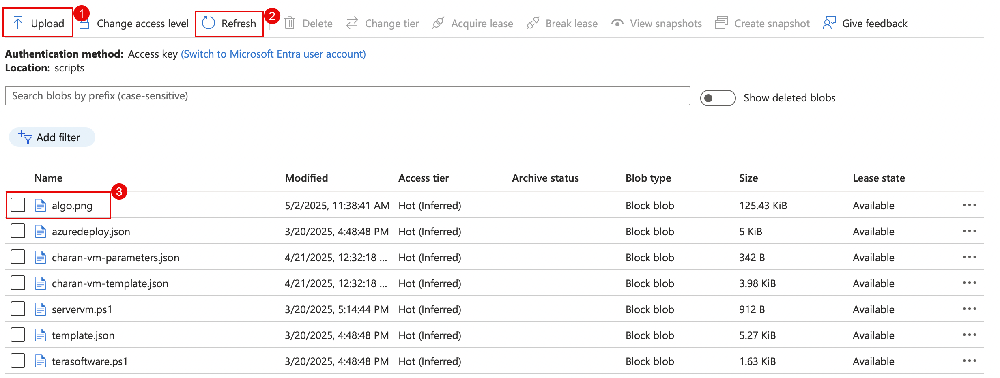 

---

## Conclusion

You have now successfully built and deployed an **event-driven Azure Function** triggered by Blob Storage. You learned how to configure and test a real-time file processing workflow using serverless architecture on Azure.
